# 小区物业管理系统

### 9.9￥ 获取完整源码+sql，需要加Q：3577148218 ,备用Q: 3808981644
### 有问题，或者需要协助调试运行项目的也可联系
### 获取更多项目，关注公众号：编程项目集

## 一、介绍

基于springboot + mybatis + thymeleaf + Mysql的物业管理系统

## 二、系统运行界面图

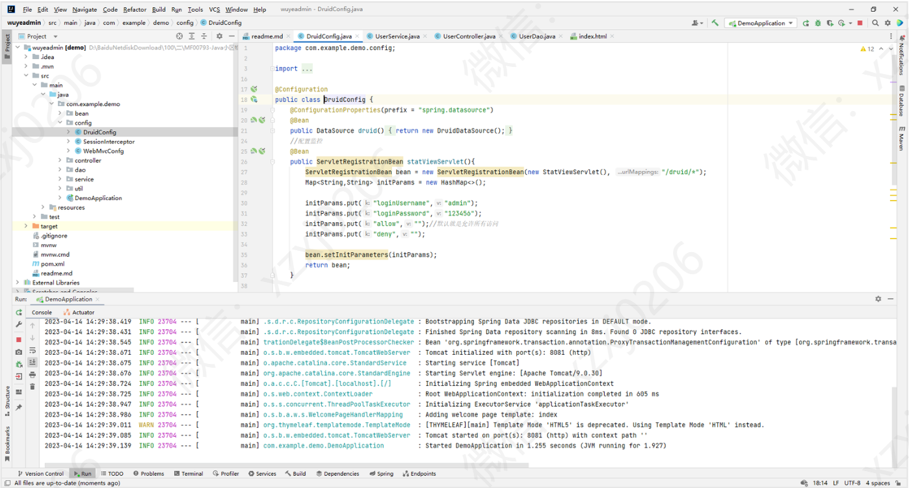

## 三、系统部分功能截图

### 1、管理员

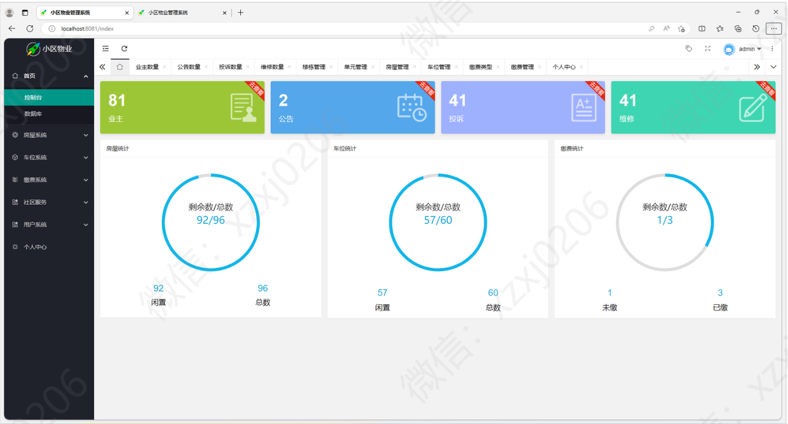

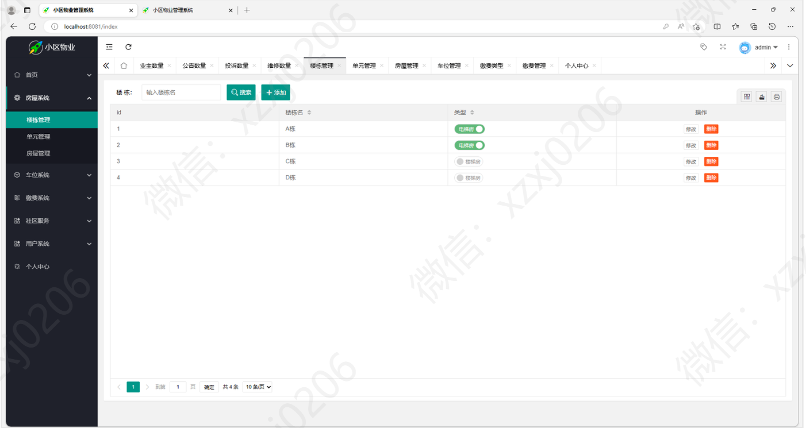

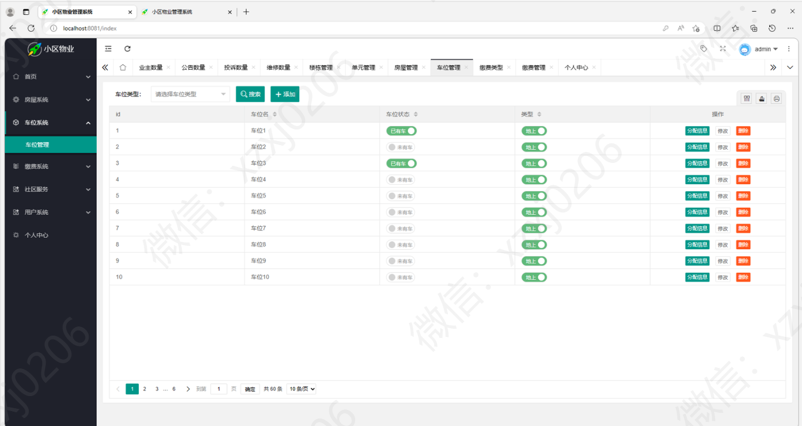

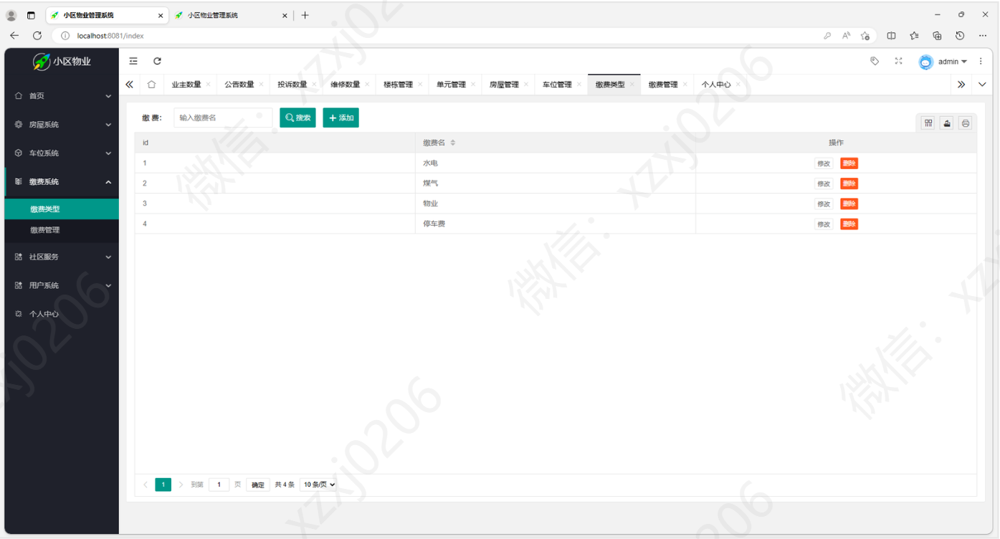

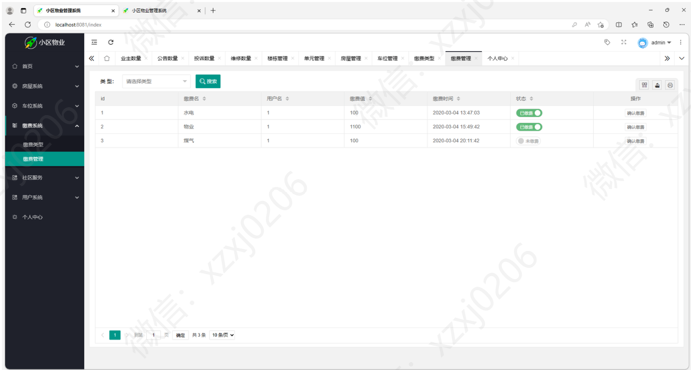

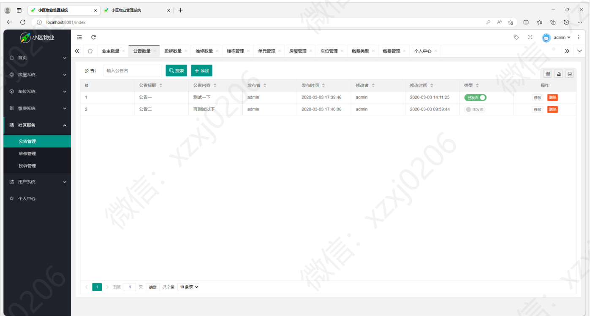

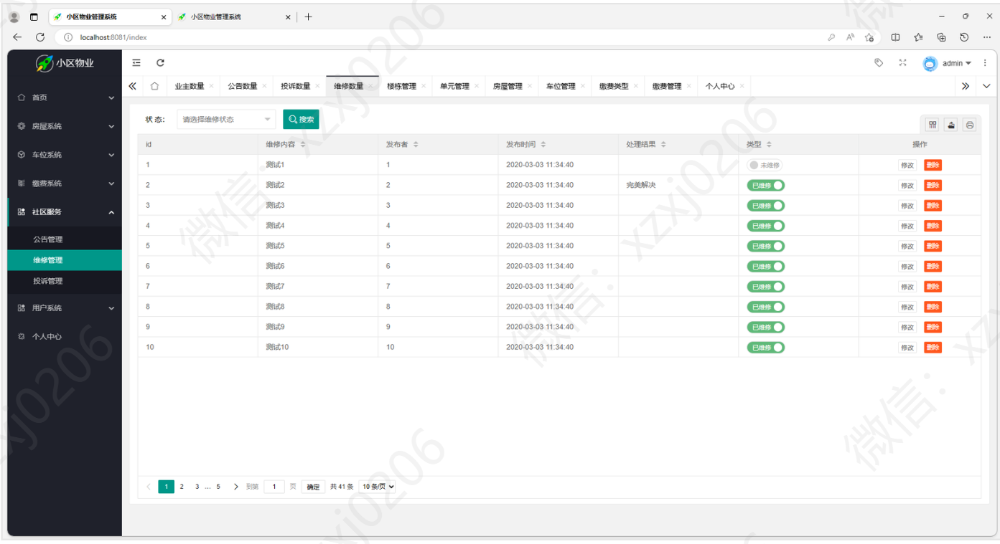

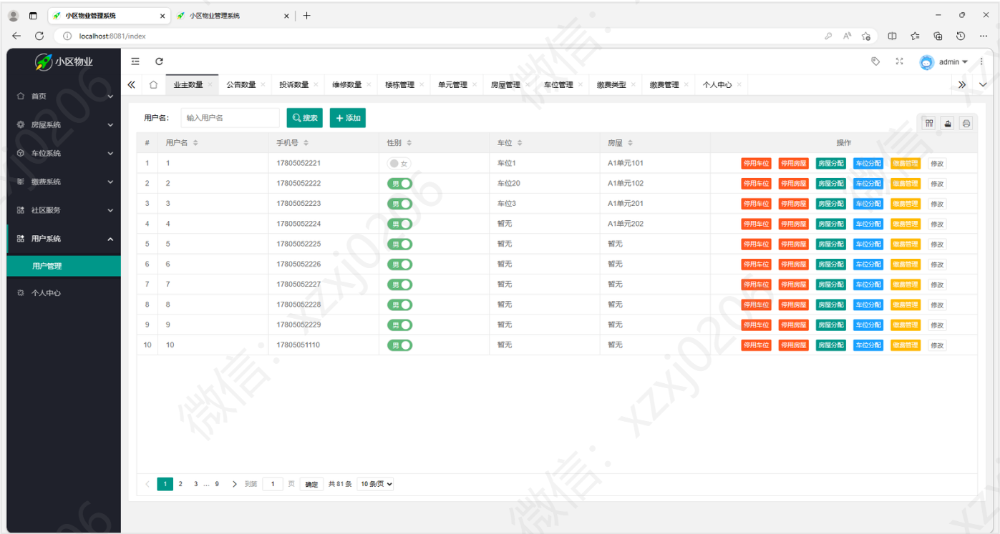

### 2、用户

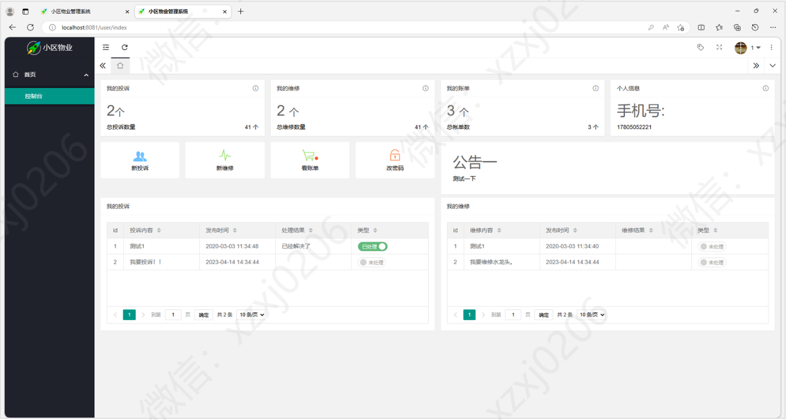

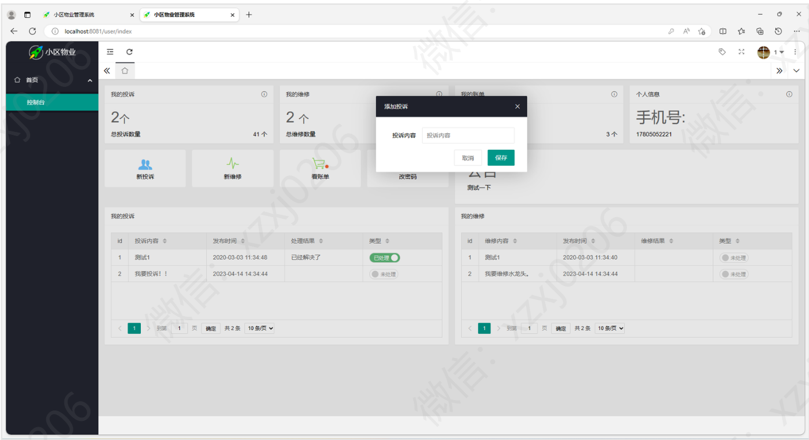

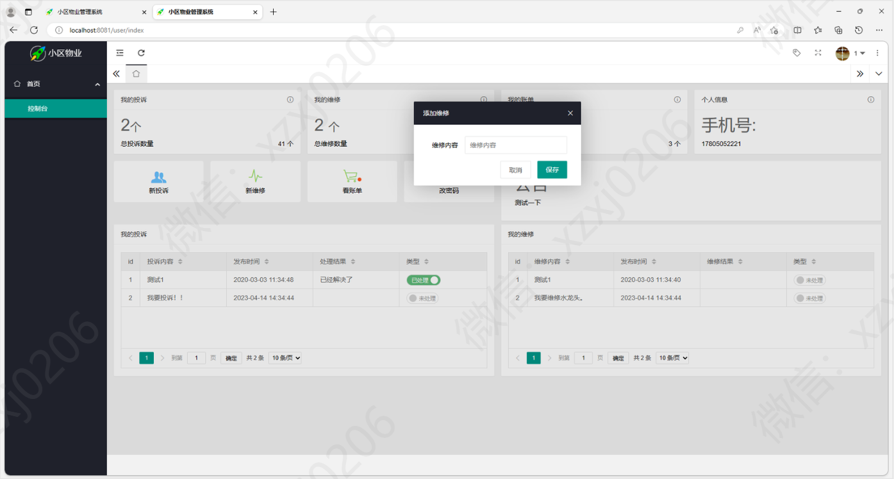

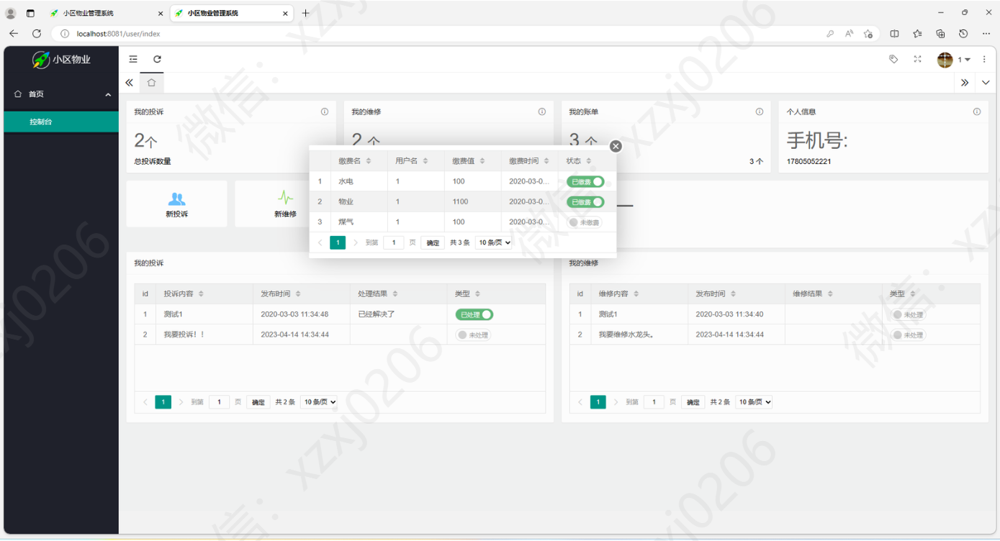

### 9.9￥ 获取完整源码+sql，需要加Q：3577148218 ,备用Q: 3808981644
### 有问题，或者需要协助调试运行项目的也可联系

